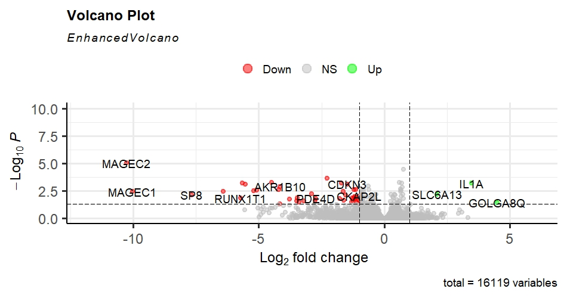
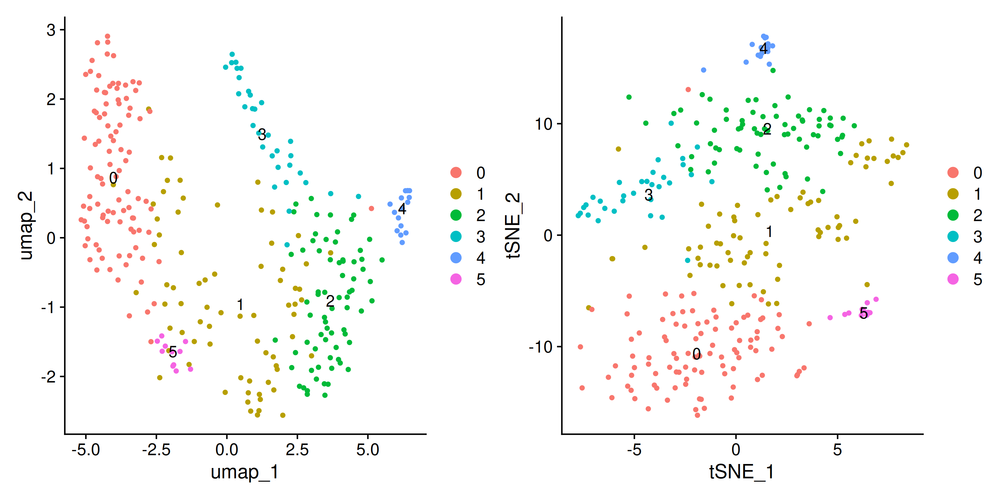

# Transcriptomics Analysis Repository

This repository contains datasets and analysis workflows for **bulk RNA-seq, single-cell RNA-seq, and spatial transcriptomics** studies. 

# *Bulk RNA-seq* (`1_Bulk_cell/`)
 
  Bulk transcriptomic gene expression data for differential expression analysis.  
  
  [Go to Bulk RNA-seq README](1_Bulk_cell/README.md)
  
   

# *Single-Cell RNA-seq* (`2_Single_cell/`)  

This repository contains a reproducible Snakemake pipeline for processing single-cell RNA-seq data using the Seurat framework in R. The pipeline automates the transition from raw count matrices to clustered populations and marker discovery.

  
   [Go to Single RNA-seq README](2_Single_cell/README.md)
   
  

  

# *Spatial Transcriptomics* (`3_Spatial/`)  
  Spatial gene expression profiling of breast cancer tissue sections using 10x Visium CytAssist technology.  
  [10x Genomics Dataset](https://www.10xgenomics.com/datasets/fresh-frozen-visium-on-cytassist-human-breast-cancer-probe-based-whole-transcriptome-profiling-2-standard)

## Click on each project above for full details, figures, and datasets.
